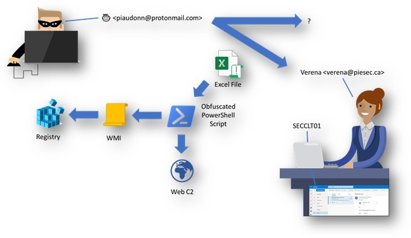

# 🐾 Spoors

This series will try to uncover the traces, audit logs and some of the OS artifacts left behind (by default, or by enabling extra stuff) when users are tricked to click where they shouldn’t have. 

## Season 1

This first season isn’t too much about hunting. But about understanding what data to look for. In a next season, we’ll focus on how to leverage Microsoft Defender 365 products as well as Microsoft Sentinel.

📜 Here is the scenario:

A bad actor sent a message to potentially multiple recipients at PieSec Corp. This message contained a malicious attachment, an Excel file with a macro, which executes obfuscated PowerShell code to do two tasks:
1. Write something in the registry (maybe to stay persistent)
2. Send a message to a C2 server



Here is the macro's code:
```
Private Sub Workbook_Open()

    Set objShell = CreateObject("Wscript.Shell")
    objShell.Run ("powershell -encodedcommand SW52b2tlLVdtaU1ldGhvZCAtQ2xhc3MgU3RkUmVnUHJvdiAtTmFtZSBTZXRTdHJpbmdWYWx1ZSAtQXJndW1lbnRMaXN0ICgyMTQ3NDgzNjQ5LCJTT0ZUV0FSRSIsIlllcyIsIkNhbkJlRGVsZXRlZCIpIDsgSW52b2tlLVdlYlJlcXVlc3QgLVVyaSAiaHR0cDovL3BlcmR1LmNvbSI=")

End Sub
```
The macro is configured to run automatically. 

💡 Note that the code is harmless. It can run on your own system without damaging anything. 

### S01E01 – The pilot
Introduction of the methodology and of the focus for the first season.

📄 No technical content.

### S01E02 – The post-person
The threat arrived in the environment via email. Could it has been stopped in the messaging platform? What traces of that message do we have in Exchange Online? Let's dig into this...  

📄 Read [S01E02](S01E02.md)

### S01E03 – Process tracks
The attachment was downloaded from Outlook and opened with Excel. In this episode we will see the traces left by those processes (and others invoked by the macro) on the victim's system.

📄 Read [S01E03](S01E03.md)

### S01E04 – PowerShell tracks
The PowerShell code was encoded in base64. In this episode, we will discover how we can track the things PowerShell does, how much visibility we get by default and how to enhance it.  

📄 Read [S01E04](S01E04.md)

### S01E05 – WMI logging
The first comdlet of the PowerShell script was `Invoke-WMIMethod`. In this episode we are going to review what is left behind where we do WMI queries on a system, whether it is with PowerShell or other tools.

📄 Read [S01E05](S01E05.md)

### S01E06 – Registry tracks
The WMI method called in the PowerShell script was modifying the registry. In this episode we will have a close look at that traces are generated when the registry is modified.

📄 Read [S01E06](S01E06.md)

### S01E07 – Track outbound network connections 
Last spoor to uncover, the outbound connections made by our macro. In this episode we will look at the traces left (or the lack of) by a network call. 

📄 Read [S01E07](S01E07.md)

## Season 2

🔜 Coming soon...