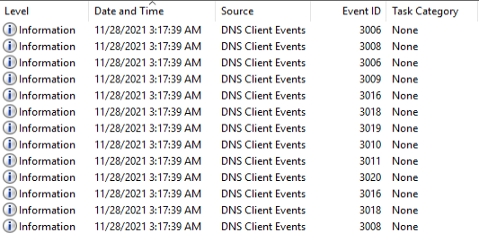
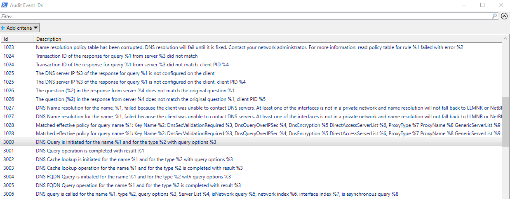
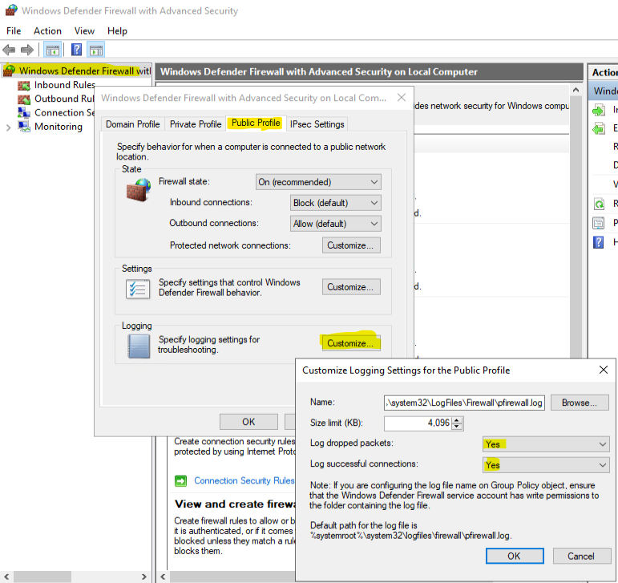
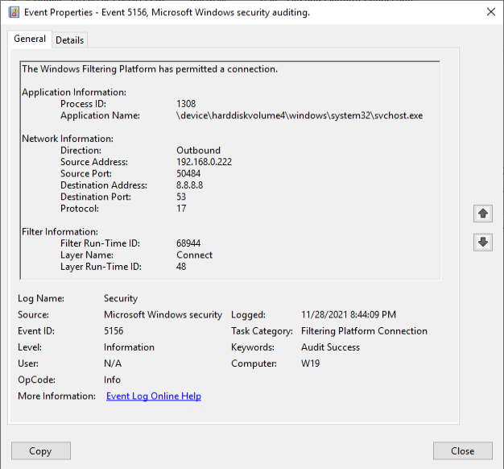
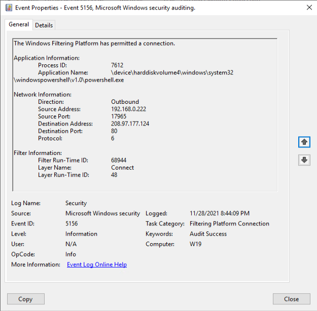
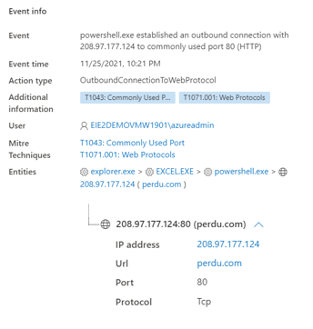
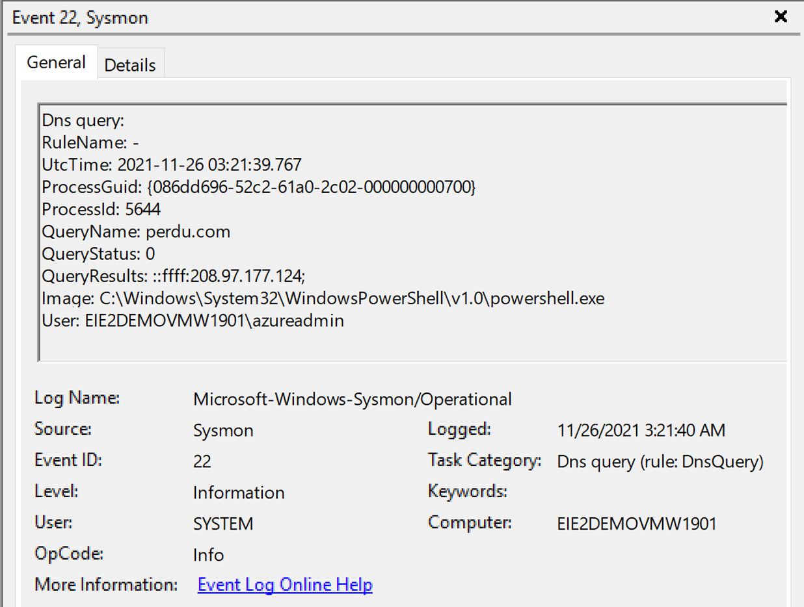
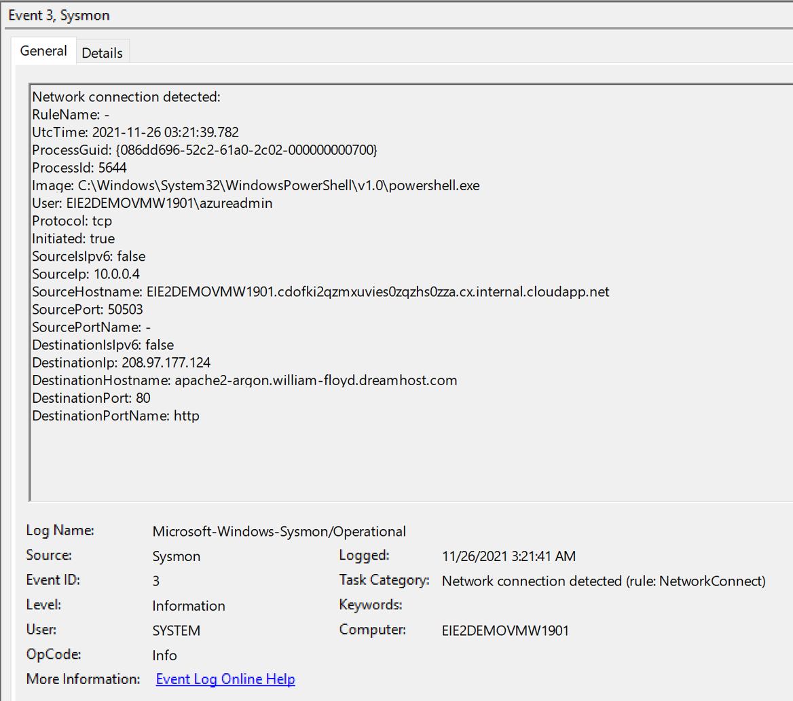

# 🐾 S01E07 - Track outbound network connections 

Our *fake* call to a C2 server is sits in the obfuscated PowerShell code launched by the Excel macro:

```powershell
Invoke-WebRequest -Uri "http://perdu.com"
```

This outbound connection offers three opportunities to be seen.
1. It is using a FQDN, so the name resolution might tell us a part of the story (transaction and/or the resolver's cache)
2. The network connection has to go through the different layers of the OS can be seen by our local Windows firewall and additional tools (such as EDR or some local tools such as `Sysmon`). And if the device is connected within our network, the different network equipment on the way to the Internet.
3. As an HTTP call, if there were some HTTP proxy configuration, we could also see that call in these logs.

We are going to focus on what is left on the actual machine where the connection took place, so essentially the point 1 and a part of the point 2.

## 🕵️‍♀️ DNS lookups

There is a very verbose logs (understand, you might be able to use it only for temporary troubleshooting - not to mention that its default size is 1Mb) in Windows called `Microsoft-Windows-DNS-Client/Operational`. One DNS lookup will generate a bunch of things there that will tell you if the record what found in the cache, what interface the query used, what DNS server answered, some performance data and even the PID of the caller (although that last one seem to be specific to Windows 11). 

Here is an example of xPath filter you can use to show only the things related to `perdu.com`:

```
 * [ EventData[ Data[@Name='QueryName'] and (Data='perdu.com')] ] 
```
Of course, in a hunting situation, you don't know in advance what name to look for. And you might not even have a name if the call is made with an IP address anyways. But for the sake of it, let's have a look at the events a call in ou case would generate:



The first `3006` entry gives us the request:
```
DNS query is called for the name perdu.com, type 1, query options 1073766400, Server List , isNetwork query 0, network index 0, interface index 0, is asynchronous query 0
```
Then we have a bunch of metadata from the call (interfaces, DNS servers...) and at some point we got an answer in the event `3020`:
```
Query response for name perdu.com, type 1, interface index 0 and network index 0 returned 0 with results 208.97.177.124;
```
If you wish to know all possible events generated by this source, you can run the following cmdlets:

```powershell
(Get-WinEvent -ListProvider "Microsoft-Windows-DNS-Client").Events | `
    Select-Object @{Name='Id';Expression={$_.Id -band 0xffffff}}, Description, @{Name='Parameters';Expression={($_.Template).template.data}} | `
        Out-GridView -Title "DNS Event IDs"
```

Here is an example of the output taken on a Windows 11 machine:



The cache has also some value since you will be able to pin point at the second when a request was made by looking at the TTL (and assuming that you know what is the records default TTL and that the record is still in cache), you could do the old school way `ipconfig /displaydns` or get modern with `Get-DnsClientCache`. In our case, our records TTL is 4 hours. We know that from a quick nslookup:

```
HEADER:
    opcode = QUERY, id = 2, rcode = NOERROR
    header flags:  response, want recursion, recursion avail.
    questions = 1,  answers = 1,  authority records = 0,  additional = 0

QUESTIONS:
    perdu.com, type = A, class = IN
ANSWERS:
->  perdu.com
    internet address = 208.97.177.124
    ttl = 14400 (4 hours)
```

So to know when a resolution was made, we could use:

```powershell
$perdu = Get-DnsClientCache -Entry "perdu.com"
(Get-Date).AddSeconds(-(14400 - $perdu.TimeToLive))
```
This will return the timestamp at which the call was made which can then be used to narrow down the process creation event search or give us a starting point to look at PowerShell logs or even network logs.

## 🔥 Windows Firewall

There are two ways to log things with the Windows Firewall:
1. Text logging with the pfirewall.log file
2. The event based logging through the `Filtering Platform Connection` advanced audit policy subcategory. 

For the first one, you can set it up directly in the console `wf.msc`. It is by profile and the profile depends if the machine has a line of sight with a domain controller (domain profile) or not (the other profiles one of which is a user's decision). Let's assume we had the proper logging configured, what would a log entry look like? For example this configuration:



Let's look at the following file (default path): `C:\Windows\System32\LogFiles\Firewall\pfirewall.log`.

```
#Version: 1.5
#Software: Microsoft Windows Firewall
#Time Format: Local
#Fields: date time action protocol src-ip dst-ip src-port dst-port size tcpflags tcpsyn tcpack tcpwin icmptype icmpcode info path pid
...
2021-11-27 3:17:39 ALLOW UDP 192.168.0.107 8.8.8.8 55008 53 0 - - - - - - - SEND 2300
2021-11-27 3:17:39 ALLOW TCP 192.168.0.107 208.97.177.124 50638 80 0 - 0 0 0 - - - SEND 20220
...
```
We can see the DNS request to the Google's DNS server followed by the call to the port 80 of 208.97.177.124. The trailing the number is the PID of the caller process. This seems to be new with Windows 11.

💡 Note that the file is not written in real time. It might tale few seconds before something that hit the wire is visible in the log file.

For the second one, the logging going to the `Security` event log, and rarely enabled because it generates so many entries that it makes the overall retention ridiculously low (some monitoring tools require that though 🤷‍♂️). The audit subcategory can be checked this way:

```
auditpol /get /subcategory:"Filtering Platform Connection"
```
For more info about `auditpol.exe`, check episode [S01E03](S01E03.md). This is what i
```
System audit policy
Category/Subcategory                      Setting
Object Access
  Filtering Platform Connection           Success
```
This is what we will see in the middle of hundred other events happening roughly at the same time:



That was out DNS resolution, followed by our outbound call from PowerShell:



We get the application name and process ID at a verbose price. The protocol number mapping is the following:

|Service|Protocol number|
|--|--|
|Internet Control Message Protocol (ICMP)|1|
|Transmission Control Protocol (TCP)|6|
|User Datagram Protocol (UDP)|17|

Full mapping information is available [here](https://docs.microsoft.com/en-us/windows/security/threat-protection/auditing/event-5156).

## 🕵️‍♀️ MDE, DNS lookup and outbound connections

It seems that `MsSense.exe` sometimes substitutes to `svchost.exe` (hosting `DnsCache` the classic DNS resolver) when Microsoft Defender for Endpoint is in the game. We'll cover that in another season but don't be scared if you see your requests are coming from this process. It also gets us the following in the device timeline:



It even associated the call with [T1043](https://attack.mitre.org/techniques/T1043/) (which is actually a deprecated technique) and a Command and Control tactic. 

## ⛑️ Sysmon here to help again

Sysmon will help us by giving us more granularity of logging. Of course in a case of an investigation, if it wasn't on at the time of the suspicious action, it won't help. But it it was on, and maybe configure with the options we already mentioned in previous episodes (such as the configuration suggested by [SwiftOnSecurity](https://github.com/SwiftOnSecurity/sysmon-config/blob/master/sysmonconfig-export.xml)) we will see the following events for DNS resolutions and outbound connections:



Followed by:



💡 Note that in the even `3` the DNS hostname is not what the caller sent but what the [`GetNameInfo`](https://docs.microsoft.com/en-us/windows/win32/api/ws2tcpip/nf-ws2tcpip-getnameinfo) API returns. 


## 📝 Summary

|Event ID|Event Log|Enabled by default|Builtin feature|Notes|
|--|--|--|--|--|
|`5156`|`Security`|No|Yes|Very verbose|
|`3006`,`3020`|`Microsoft-Windows-DNS-Client`|No|Yes|Very verbose|
|`3`,`22`|`Microsoft-Windows-Sysmon/Operational`|No|No|Requires custom configuration file|

To which we can add the `pfirewall.log` file.